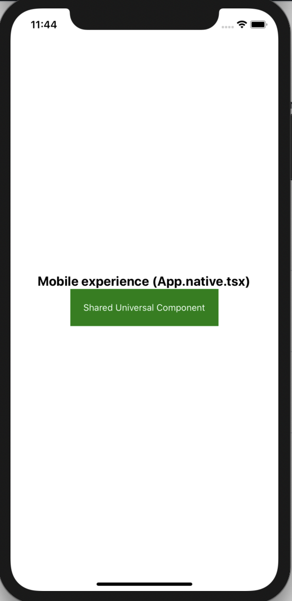

# expo-universal-example

Run `expo start` and then run in ios/android and web to see the conditional `App.web.tsx` and `App.native.tsx` rendering. The html `DropdownMenu` only shows for web, but the `SharedUniversalComponent` shows for both platforms and renders as HTML in web context.

# Web Screenshot

# Mobile Screenshot

